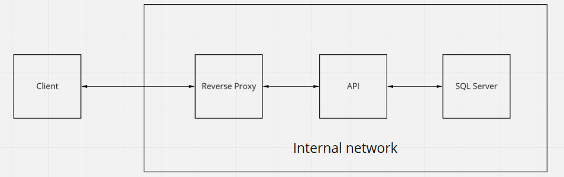
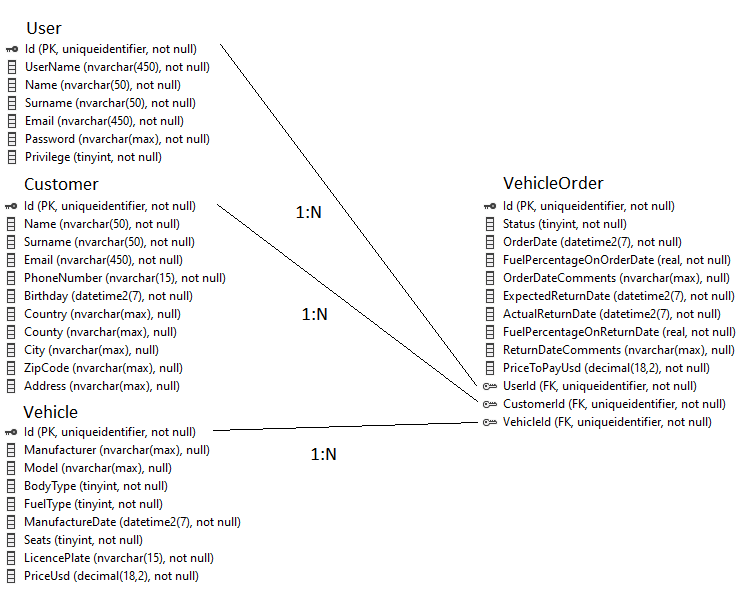
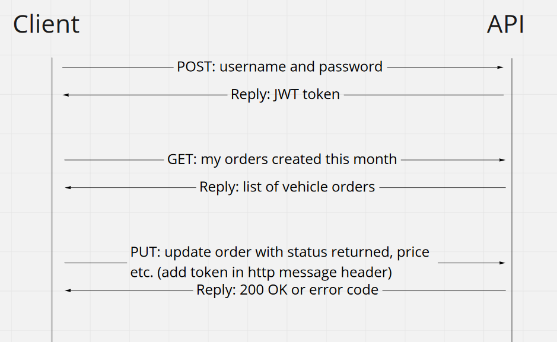

# Vacation Hire Inc.
1. [Summary](#Summary)
1. [Deploy Example](#Deploy-Example)
2. [ER Diagram](#ER-Diagram)
3. [Example Flow](#Example-Flow)
4. [Scripts](#Scripts)

## Summary

This is a non-commercial product to demonstrate the use of Web.API, Entity Framework code-first approach, and token authentication with JWT.
The solution is composed of 4 projects:
* VacationHireInc.DataLayer  
  * implements Unit of Work and Repository pattern and it's used to initialize the database with EF Core and then access it with the API.
* VacationHireInc.Security  
  * utility classes for token generation and validation and for passwords hashing
* VacationHireInc.WebApi  
  * implementation of REST API service
* VacationHireInc.Tests
  * Contains unit tests (MSTest, Moq)  
The web service allow for users (admin or clerk) to register and update vehicle renting orders.

## Deploy Example

The web service is using http, so it's recommended to either enable SSL in Web.API or use this service in a private network that has a front
facing reverse proxy for SSL termination.

The service is not intended to be used in a microservice environment. It can be tried using SQL partitioning and master-slave replication, 
a load balancer and many instances of this service (which, if they all use the same token generation key in appsettings.json, then clients 
can authenticate with the same token on any of them). Also using EF with
[Cosmos DB](https://docs.microsoft.com/en-us/ef/core/providers/cosmos/?tabs=dotnet-core-cli "Cosmos DB") can be investigated.

## ER Diagram

Note: Cascate delete is enabled by default in EF. When deleting a user, vehicle or customer, their vehicle orders will aslo get deleted.

## Extending Code

Vehicles have BodyType (Truck, Minivan, Sedan) and FuelType (Diesel, CNG, LPG, Petrol, Electric, Hybrid). These values are integers in the
database, but are represented as enum in class code. To add a new type of body or fuel, simply add new values to enums in class
"VacationHireInc.DataLayer\Models\Vehicle.cs". The api endpoints "api/v1/vehicle/fuelTypes" and "api/v1/vehicle/bodyTypes" will return the
values.

To add a new product for rent, implement the model class that will represent the entity by inheriting BaseModel class. Then add a DbSet 
of the new entity in AppDbContext, a new configuration class and, optionally, an initializer. Configuration and initialization should
then be called by OnModelCreating in AppDbContext. Now you can create a new migration and update the database. 
Next, create a new controller for the entity with CRUD operation + other specific action methods. Use the existing code as reference.

## Example Flow

## Scripts

Solution contains useful powershell script to:
* Run a SQL Server instance in docker: RunDockerSqlServer.ps1
* Delete existing migrations, create a new one and update the database: CleanMigrateEF.ps1
* Run unit tests in console: RunUnitTests.ps1
* Run the API in console: RunApi.ps1

Change directory to the solution root before running scripts!

The API can be accessed from a browser with swagger (by default, on port 44002). To authenticate, use for password the username + "pw".
